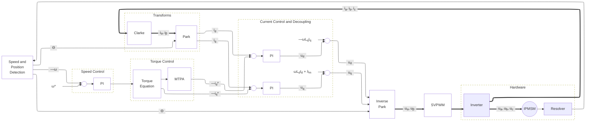

### Control Architecture

```mermaid
%%{ init: {'flowchart': {'defaultRenderer': 'elk'}} }%%
flowchart LR

    %% Inputs
    ω*:::nobox --> sum_ω --> pi_ω --> t_eq
    %% τ*:::nobox --> mtpa

    %% Torque Control    
    subgraph fw[Torque Control]
        t_eq[<br>Torque<br>Equation<br><br>]:::box
        mtpa[<br>MTPA<br><br>]:::box
    end
    fw:::group

    detection[Speed and <br>Position <br>Detection]:::box

    %% Transforms
    subgraph tr[Transforms]
        clarke[<br>Clarke<br><br>]:::box
        park[<br>Park<br><br>]:::box
    end
    tr:::group

    inv_park[<br>Inverse<br>Park<br><br>]:::box

    %% Speed Control
    subgraph sc[Speed Control]
        sum_ω((x)):::sum
        pi_ω[PI]:::box
    end
    sc:::group

    sc ~~~ fw

    %% Current Control
    subgraph cc[Current Control and Decoupling]
        sum_id((x)):::sum
        sum_iq((x)):::sum
        pi_id[PI]:::box
        pi_iq[PI]:::box
        decopling_d["—ωL<sub>q</sub>I<sub>q</sub>"]:::nobox
        decoupling_q["ωL<sub>d</sub>I<sub>d</sub> + λ<sub>m</sub>"]:::nobox
        sum_vd((x)):::sum
        sum_vq((x)):::sum
    end
    cc:::group

    decopling_d --> sum_vd
    decoupling_q --> sum_vq

    svpwm[<br>SVPWM<br><br>]:::box

    subgraph hw[Hardware]
        inverter[<br>Inverter<br><br>]
        ipmsm((<br>IPMSM<br><br>))
        resolver[Resolver]
    end
    hw:::group
    inv_park ~~~ svpwm ~~~ inverter

    t_eq --> mtpa
    t_eq -->|"&nbsp; —i<sub>q</sub>* &nbsp;"| sum_iq

    park -->|"&nbsp; i<sub>d</sub> &nbsp;"| sum_id
    park -->|"&nbsp; i<sub>q</sub> &nbsp;"| sum_iq
    mtpa -->|"&nbsp; —i<sub>d</sub>* &nbsp;"| sum_id

    clarke ==>|"&nbsp; i<sub>α</sub>, i<sub>β</sub> &nbsp;"| park
    sum_id --> pi_id["PI"]
    sum_iq --> pi_iq["PI"]

    pi_id -->|"&nbsp; u<sub>d</sub> &nbsp;"| sum_vd
    pi_iq -->|"&nbsp; u<sub>q</sub> &nbsp;"| sum_vq

    sum_vd -->|"&nbsp; u<sub>d</sub> &nbsp;"| inv_park
    sum_vq -->|"&nbsp; u<sub>q</sub> &nbsp;"| inv_park

    inv_park ==>|"&nbsp; u<sub>α</sub>, u<sub>β</sub> &nbsp;"| svpwm

    svpwm ==> inverter
    inverter ==>|"&nbsp; u<sub>a</sub>, u<sub>b</sub>, u<sub>c</sub> &nbsp;"| ipmsm
    inverter ==>|"&nbsp; i<sub>a</sub>, i<sub>b</sub>, i<sub>c</sub> &nbsp;"| clarke
    ipmsm --> resolver
    resolver --> detection

    detection -->|"&nbsp; —ω &nbsp;"| sum_ω
    detection -->|"&nbsp; Θ &nbsp;"| park
    detection -->|"&nbsp; Θ &nbsp;"| inv_park

    %% Styles
    classDef box fill:none;
    classDef group fill:none,stroke-dasharray: 5 5;
    classDef sum fill:none, color:white;
    classDef nobox fill:none, stroke:none;
```