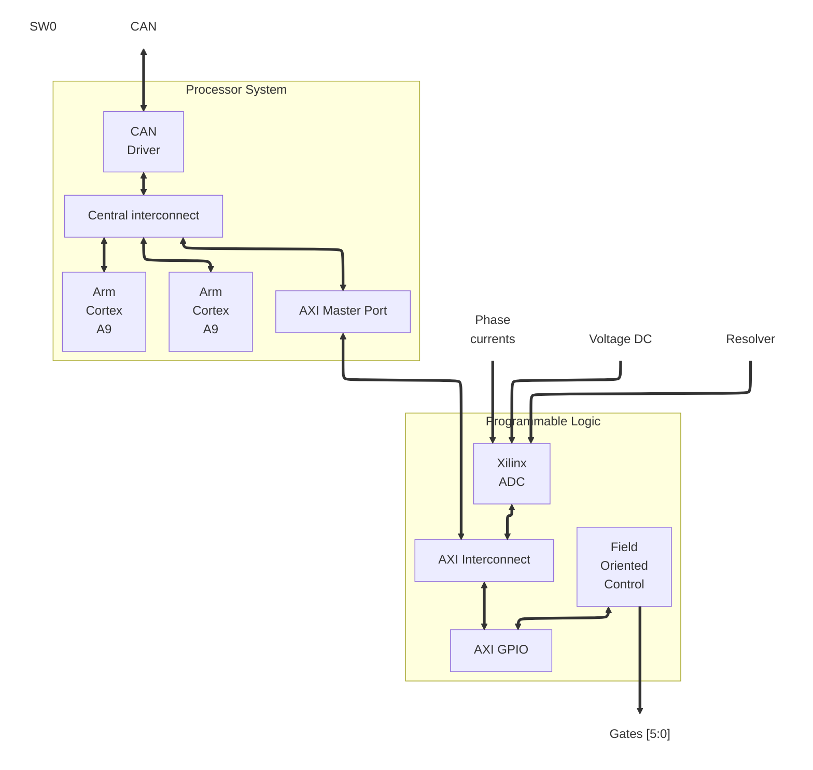

```mermaid	
%%{init: {'flowchart': {'defaultRenderer': 'elk'}}}%%
flowchart
    classDef nobox fill:none, stroke:none;

    %% Inputs
    SW0:::nobox
    curr["Phase <br> currents"]:::nobox ==> xadc
    volt[Voltage DC]:::nobox ==> xadc
    res[Resolver]:::nobox ==> xadc

    %% Outputs
    gates["Gates [5:0]"]:::nobox

    %% Communications
    CAN:::nobox <==> can_driver
    
    %% Programmable Logic
    subgraph pl[Programmable Logic]
        axi_gpio[AXI GPIO]
        axi_inter[AXI Interconnect]
        xadc[Xilinx <br> ADC]
        control[Field <br> Oriented <br> Control]
    end
    pl

    %% Processor System
    subgraph ps[Processor System]
        can_driver[CAN <br> Driver]
        c[Central interconnect]
        axi_master[AXI Master Port]
        pro1[Arm <br> Cortex <br> A9]
        pro2[Arm <br> Cortex <br> A9]
        
    end
    ps

    %% AXI interconnections
    xadc <==> axi_inter
    axi_master <==> axi_inter
    axi_inter <==> axi_gpio
    control <==> axi_gpio
    can_driver <==> c
    c <==> axi_master
    c <==> pro1
    c <==> pro2
    control ==> gates
```