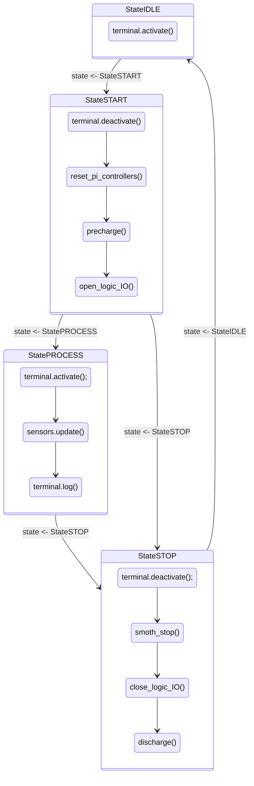
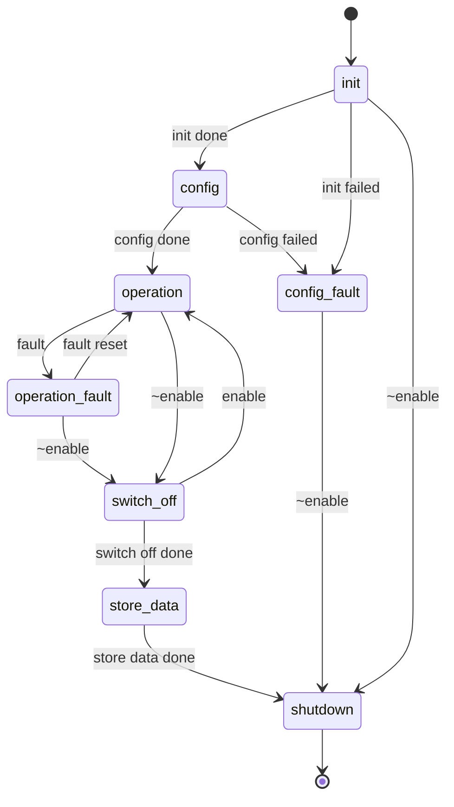
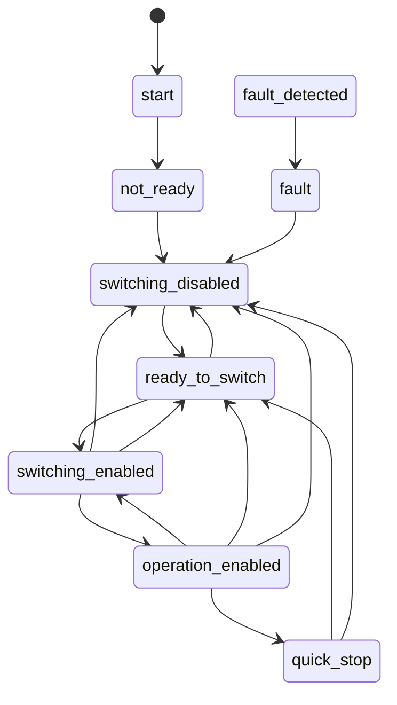
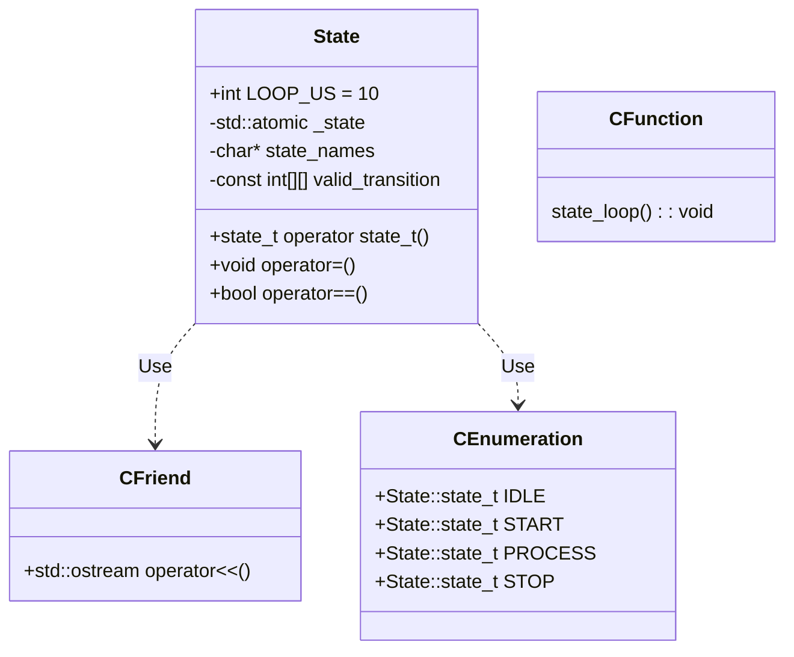
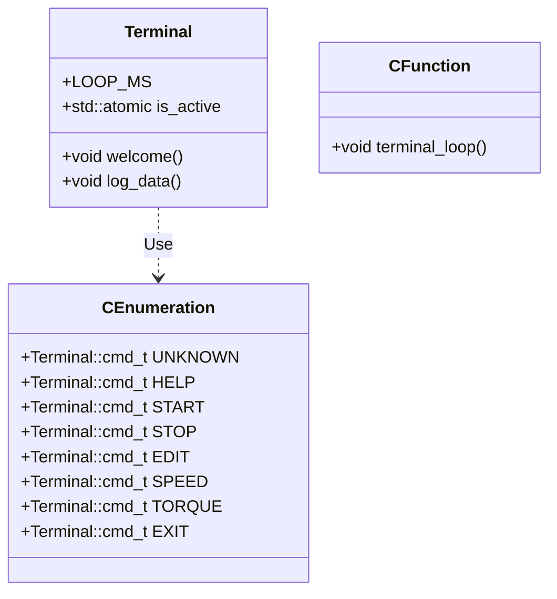
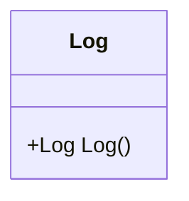
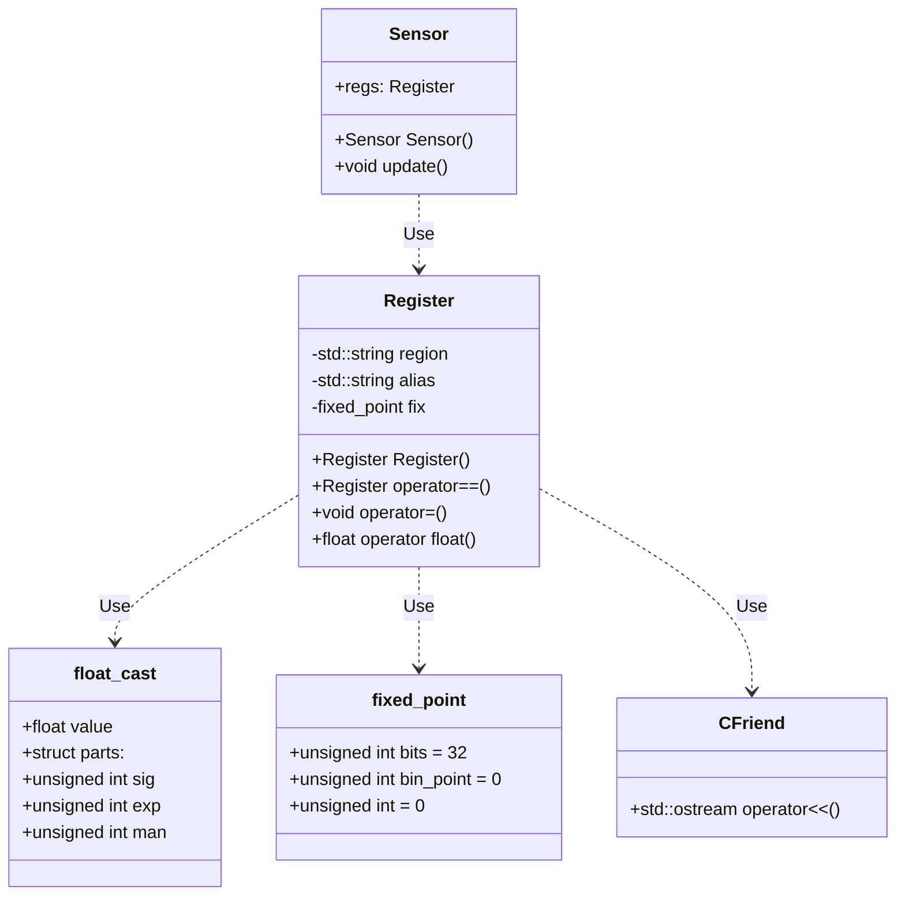

# State machine
By [Xicu Marí](hello@xicu.info)

## Table of contents
1. [Table of contents](#table-of-contents)
2. [Some To Do's](#some-to-dos)
3. [Block diagram](#block-diagram)
4. [Classes](#classes)
   1. [State](#state)
   2. [Terminal](#terminal)
   3. [Log](#log)
   4. [Register](#register)

## Some To Do's

- [ ] Specify the state machine standard.
- [ ] Get rid of old code.
- [ ] Perform tests.

## Block diagram

## Classes

### State

### Terminal

### Log

### Register

